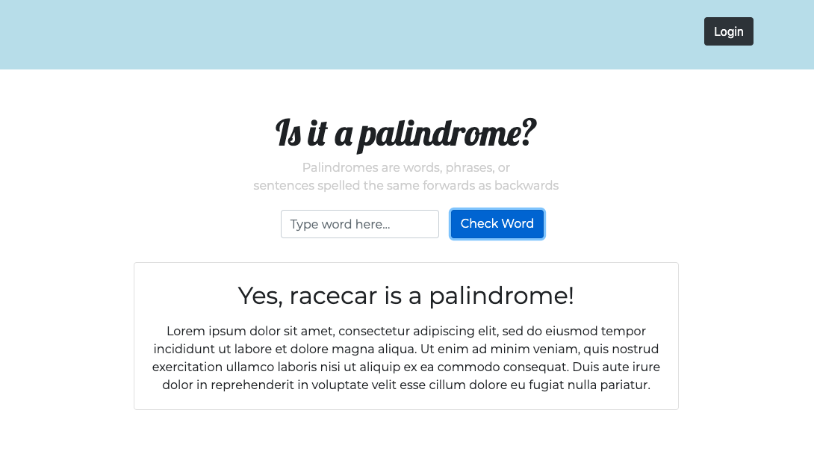

# Is it a palindrome?  

> A simple wwebpage to determine whether a user input is a palindrome
> Palindromes are words, phrases, or sentences spelled the same forwards as backwards

Per the requirements, this exercise includes the double challenge, allowing users to check if a word, phrase, or sentence is a palindrome while ignoring uppercase, punctuation, and spaces. Below are all examples that will register as palindromes: 

```
senile felines
```
```
Noel sees Leon
```
```
A man, a plan, a canal -- Panama
```

### Demo

Image one: 


Check out the video demo [here](https://getbootstrap.com/). 

### This project was built with...
* HTML5
* CSS3
* JavaScript (ES6)
* jQuery 
* Bootstrap 

### Attributions 
* [Google Fonts](https://fonts.google.com/)

## Author
**Tomas Gear:** [Github](https://github.com/nexio-t) | [Portfolio](http://www.tomas-gear.com)